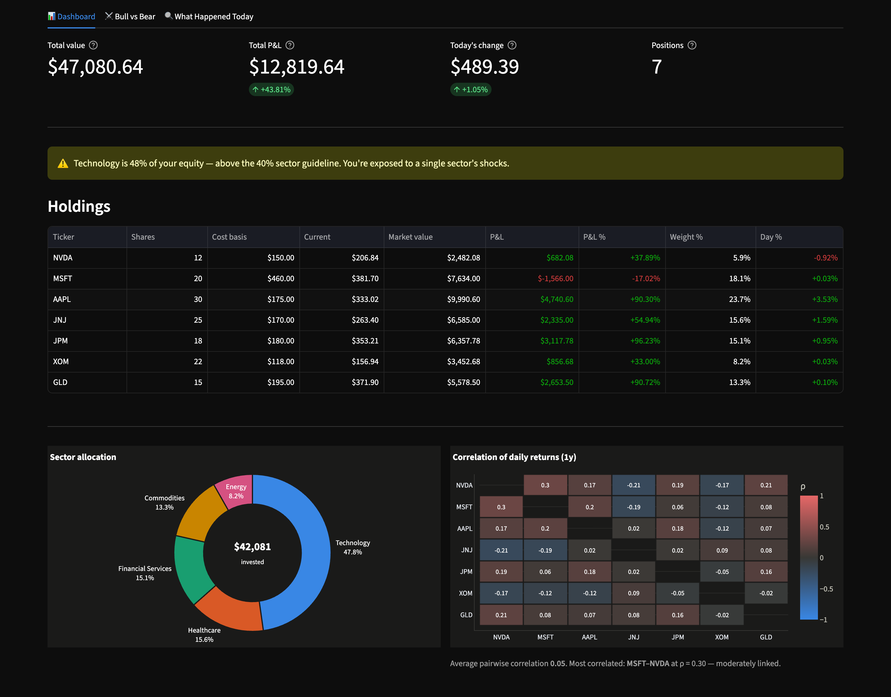
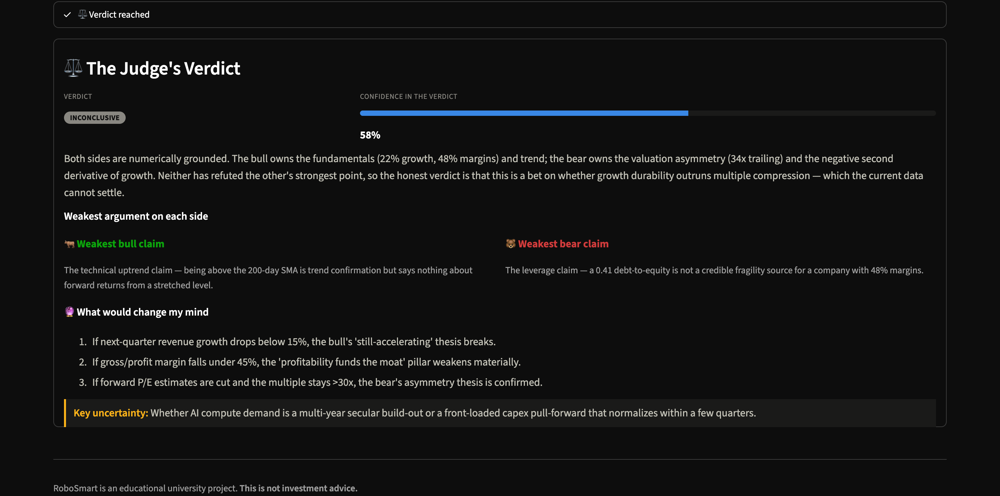
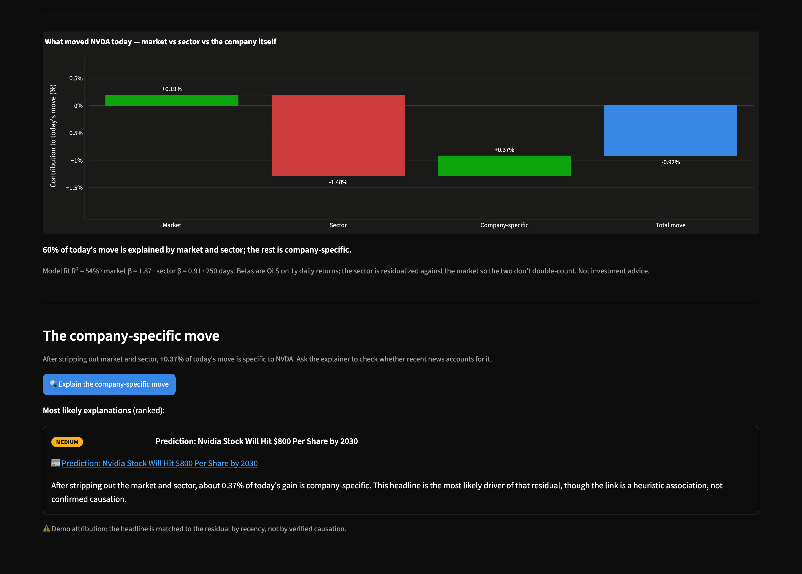

# RoboSmart Investment — Project Summary Document

**Course:** AI & Innovation in Capital Markets
**Track:** 3 — Software Product
**Deliverable:** Streamlit web application, deployed to Hugging Face Spaces
**Author:** Person 5 (documentation and narrative)

---

## 1. The financial problem

A retail investor who wants to understand their own stock portfolio today faces a
choice between two unsatisfying tools, and neither of them closes the gap between
*data* and *understanding*.

On one side sit the brokerage dashboards and spreadsheet exports. These are
rigorous but mute. They will tell an investor that their portfolio is worth a
certain amount, that it is up or down some percentage on the day, and — if the
investor is willing to build the formulas themselves — that a given position is a
certain fraction of the book. What these tools never do is *interpret*. They do
not say "this is dangerously concentrated," they do not say "most of your daily
moves are just the market moving and have nothing to do with the companies you
picked," and they certainly do not say "today's drop in this holding is not
explained by anything in the news, so be careful attributing a story to it." The
numbers are correct and the meaning is absent. The investor is left to supply the
judgement, which is precisely the part they lack.

On the other side sit the new generation of AI chat tools and "AI stock
assistants." These are fluent but ungrounded. Ask a general-purpose language model
why a stock moved and it will produce a confident, well-written paragraph — often
one that is disconnected from what actually happened in the price, that invents a
catalyst, or that dresses up a market-wide move as if it were company-specific
news. The output *reads* like analysis. It is frequently what practitioners call
"AI slop": narrative with no measured quantity behind it, no decomposition of the
move, and no acknowledgement of uncertainty. Where the brokerage dashboard gives
numbers with no interpretation, the naive AI assistant gives interpretation with
no numbers.

RoboSmart is built to occupy the gap between these two failures. The design
premise is that *every qualitative statement the system makes should be anchored
to a quantity the system computed*, and that the quantitative machinery should be
deterministic, inspectable, and unit-tested rather than generated by a language
model. The language model is used only where it genuinely adds value — turning a
grounded, pre-computed set of numbers into readable reasoning, and reasoning
about the one residual quantity (idiosyncratic, company-specific movement) that
genuinely requires interpretation of external text. The intended user is a
non-professional investor who holds a handful of equities and one or two
diversifiers, who can read a chart, and who wants an honest second opinion rather
than either a data dump or a sales pitch. The honesty requirement is central:
throughout, the system is engineered to be able to say "the evidence is
inconclusive" or "no clear cause found," because a tool that is always confident
is a tool that is sometimes confidently wrong.

---

## 2. Architecture

RoboSmart is organised into three layers, and the single most important design
decision in the project lives in the boundary between the second and the third.

**The data layer.** A shared data module is responsible for acquiring and
normalising all market data. A user uploads a portfolio as a CSV — ticker,
quantity, and cost basis per position. The data layer validates and cleans this
input, then uses `yfinance` to fetch historical prices for each holding, for the
S&P 500 proxy (SPY), and for the relevant sector ETFs. From the price history it
derives the objects every downstream feature consumes: a matrix of *daily
returns*, current market values and profit-and-loss per position, sector tags,
and the aligned return series used by the factor model. Crucially, the data layer
is *mock-first*: a bundled context file lets the entire application run with no
API key and no network connection, returning a realistic frozen dataset. This is
what makes the app demonstrable in a classroom, gradeable by a lecturer offline,
and testable in continuous integration.

**The three features, built on top of that layer:**

1. **Portfolio Dashboard** — a purely computational view. It reports total value
   and P&L; sector allocation with concentration warnings; a correlation matrix of
   daily returns; the portfolio's beta and R² regressed on its own return series;
   annualised volatility; maximum drawdown; the effective number of holdings
   (1/HHI); and cumulative performance against the S&P 500, both indexed to 100.

2. **Bull vs Bear** — a structured multi-agent debate. Three language-model
   agents (a Bull, a Bear, and a Judge) argue over a single holding across five
   rounds, under rules that force every claim to cite a number and forbid the
   Bear from ever conceding.

3. **What Happened Today** — an OLS factor model that decomposes a holding's
   move on a given day into a market component, a sector component, and a
   company-specific residual, after which a language model explains *only* the
   residual using news headlines.

**Why deterministic math is separated from LLM reasoning.** The features divide
cleanly into two categories. The Dashboard and the factor model are
*deterministic math*: given the same prices, they return the same numbers every
time, those numbers can be checked by hand, and they are covered by unit tests.
The debate and the residual explainer are *LLM reasoning*: they take grounded
numbers as input and produce natural-language argument or explanation as output.

Keeping these two categories in physically separate modules is not a stylistic
preference; it is what makes the product trustworthy and gradeable. First, it
means the numbers are never at the mercy of a stochastic model — a beta is a
regression coefficient, not a token the model happened to emit, so it is
reproducible and correct by construction. Second, it makes the system *testable*
in the parts where testing is meaningful: you cannot unit-test a paragraph of
prose, but you can unit-test that HHI, beta, R², drawdown, and the factor
decomposition are computed correctly, and those tests are the backbone of the
quality argument. Third, it localises the risk. The failure modes of a language
model — fluent confabulation, false confidence — are quarantined to the two
places where a human reader knows to treat the output as argument rather than as
fact, and everywhere the model speaks, it is speaking *about* numbers that were
computed deterministically upstream. The separation is the reason the system can
be simultaneously expressive and honest.

```
                            User CSV upload
                                   │
                    ┌──────────────▼───────────────┐
                    │  DATA LAYER                  │
                    │  yfinance · clean · cache    │
                    └──┬───────────┬───────────┬───┘
         daily returns │   prices &│   aligned │
              matrix   │  positions│ SPY/sector│
                       ▼           ▼           ▼
   ┌─────────────────────────────┐   ┌────────────────────────────┐
   │   DETERMINISTIC MATH        │   │   LLM REASONING            │
   │   · dashboard metrics       │   │   · Bull / Bear / Judge    │
   │   · OLS factor model ───────┼──▶│   · residual explainer     │
   └─────────────────────────────┘   └────────────────────────────┘
         the ONLY arrow crossing that boundary carries
             "idiosyncratic residual + headlines"
                                   │
                                   ▼
        ┌──────────────────────────────────────────────────┐
        │  STREAMLIT UI — 3 tabs, one shared theme.py      │
        └──────────────────────────────────────────────────┘

  Anthropic API is reachable from the LLM column only. USE_MOCK=1 serves
  recorded output instead, so the whole app runs with no API key.
```

The single crossing arrow is the point: the language model never sees a raw price
series and never computes a number. It receives one figure the regression already
produced, and its only job is to say what might explain it.

---

## 3. Method

### 3.1 The factor model and why the sector ETF is residualized

For a single holding on a single day, the goal is to answer a specific question:
*of the stock's move today, how much was the whole market, how much was its
sector, and how much was the company itself?* The natural tool is a linear
factor model estimated over a trailing window of daily returns:

> **r_stock = α + β_mkt · r_SPY + β_sector · r_SECTOR_RESID + ε**

where `r_stock` is the holding's daily return, `r_SPY` is the market proxy's
return, `r_SECTOR_RESID` is the sector ETF's return *after* it has been
residualized against SPY, and `ε` is the idiosyncratic, company-specific residual.

The residualization step is the methodological core. A sector ETF — say a
technology ETF — is itself enormously correlated with the broad market: when SPY
rises, the technology ETF almost always rises too. If we regressed the stock
directly on *raw* SPY and *raw* sector-ETF returns, the two regressors would be
strongly collinear, and the market's influence would be double-counted and
arbitrarily split between the two betas. The fix is a two-stage (Frisch–Waugh–
Lovell) construction. First we regress the sector ETF on SPY:

> r_SECTOR = a + b · r_SPY + u

and keep the residual `u = r_SECTOR_RESID`, which is the part of the sector's
movement that is *orthogonal to the market* — "sector news net of the market." We
then use that orthogonalized series as the second regressor for the stock. Because
`r_SECTOR_RESID` is by construction uncorrelated with `r_SPY`, the market beta
`β_mkt` now cleanly captures market exposure, `β_sector` captures pure sector
exposure, and the two contributions add up without overlap. The decomposition of
the day's move is then simply: market contribution = `β_mkt · r_SPY`, sector
contribution = `β_sector · r_SECTOR_RESID`, and idiosyncratic = the day's actual
residual `ε`. Only the last term — the company-specific piece — is handed to the
language model to explain.

*Worked decomposition (NVDA, live data, 2026-07-26):* a total move of **−0.92%**
decomposes into market **+0.19%**, sector **−1.48%**, and idiosyncratic **+0.37%**,
with **R² = 54%**, β_market = 1.87 and β_sector = 0.91 over 250 days. In words: the
market was mildly up, the market-neutral semiconductor sector was sharply down and
did nearly all the damage, and something company-specific pushed *back up* by
+0.37%. Only that last figure is worth asking "why?" about — and note it points the
opposite way to the headline number, which is exactly the kind of thing a raw
"NVDA fell today" reading hides.

### 3.2 The multi-agent debate design

The Bull vs Bear feature stages a structured disagreement over one holding among
three agents:

- **Bull** — argues the constructive case for the position.
- **Bear** — argues the destructive case.
- **Judge** — weighs the exchange and renders a verdict.

The debate runs for **five rounds**. The design choices are deliberately
adversarial and anti-sycophantic:

- **Forced disagreement.** The Bear is instructed that it may *never* concede. This
  is a guard against the well-documented tendency of language models to converge,
  agree, and produce a bland consensus. By forbidding capitulation, the system
  guarantees that the strongest available counter-argument is always articulated,
  so the user sees genuine two-sided tension rather than a model talking itself
  into agreement.
- **A Judge that may abstain.** The Judge is explicitly permitted to return an
  **"inconclusive"** verdict. A tool that is forced to pick a winner every time
  will manufacture false confidence; allowing abstention is what makes the
  verdict, when it *is* decisive, worth something.
- **Mandatory falsifiers.** The Judge must output **three concrete falsifiers** —
  specific, checkable statements of "what would change my mind." This converts the
  verdict from an opinion into a testable position and gives the user an actionable
  watch-list rather than a conclusion to take on faith.

### 3.3 Prompt-engineering decisions

The behaviour above is enforced in the system prompts, not left to chance:

- **Evidence grounding.** Every claim an agent makes must cite a specific number
  drawn from the portfolio data (a beta, a correlation, a weight, a drawdown, a P&L
  figure). Assertions without a cited quantity are disallowed by the prompt. This
  is the mechanism that keeps the debate from drifting into the "AI slop" failure
  mode described in Section 1.
- **Forced disagreement**, as above, encoded as an unconditional rule for the Bear.
- **Mandatory falsifiers**, as above, encoded as a required output field for the
  Judge.
- **Permitted "I don't know."** Both the Judge ("inconclusive") and the residual
  explainer ("no clear cause found") are explicitly *allowed and encouraged* to
  decline. Making abstention a first-class, sanctioned output — rather than an
  implicit failure — is the single most important honesty lever in the system.
- **No-hallucination rules.** The prompts forbid inventing data, catalysts, or
  figures not present in the provided context, and instruct the models to reason
  only over the numbers and headlines supplied to them.

### 3.4 The dashboard methods

- **Portfolio beta with R².** Rather than betas of individual names, the Dashboard
  estimates the *portfolio's* beta by regressing the portfolio's own daily return
  series on the market's, and reports the R² alongside it so the reader can judge
  how much of the portfolio's variation the single market factor actually
  explains. *(Demo book, 2026-07-26: β = 0.60, R² = 43% on 250 days — the market
  explains under half this book's variance, which is itself the useful signal.)*
- **Correlation of daily returns.** The correlation matrix is computed on *daily
  returns*, not price levels, because correlations of price levels are dominated by
  common trends and are largely spurious. *(Demo book: average pairwise correlation
  0.05, most-correlated pair MSFT–NVDA at ρ = 0.30; JNJ is negatively correlated to
  both, and GLD's is the lowest in the book — the diversifiers doing their job. We
  verified these against an independent `yfinance` computation and they agree to
  three decimals.)*
- **Concentration thresholds.** The Dashboard raises explicit warnings when a
  single position exceeds **25%** of the book, when any sector exceeds **40%**, or
  when the top-3 positions together exceed **60%**. *(Demo book: Technology at 48%
  of equity trips the sector flag.)*
- **Effective number of holdings.** Diversification is summarised by the inverse
  Herfindahl–Hirschman Index, `1/HHI` where `HHI = Σ wᵢ²`. This answers "how many
  equally-weighted positions would give me the same concentration I actually have?"
  *(Demo book: 6.1 effective holdings out of 7 actually held.)*
- **Additional risk metrics.** Annualised volatility (daily standard deviation
  scaled by √252) and maximum drawdown (largest peak-to-trough decline of the
  cumulative return path) round out the risk picture, and cumulative performance is
  shown against the S&P 500 with both series indexed to 100.

---

## 4. Results

The delivered system is a three-tab Streamlit application that runs end-to-end,
online with live data or fully offline in mock mode. What each tab produces:

**Portfolio Dashboard.** On upload, the user immediately sees total portfolio
value and aggregate P&L, a sector-allocation breakdown with any concentration
thresholds tripped and flagged in-line, a daily-returns correlation heatmap, the
portfolio's beta and R², annualised volatility, maximum drawdown, the effective
number of holdings, and a performance-versus-S&P-500 chart indexed to 100. In the
bundled demo book, run on live data on 2026-07-26, the reader sees a **portfolio
beta of 0.60 with R² = 43%** on 250 days (a defensive, only partly market-explained
book), an **average pairwise correlation of 0.05**, **6.1 effective holdings out of
7**, a **Technology = 48%** sector-concentration flag, annualised volatility of
**11.8%**, a maximum drawdown of **−7.4%**, and a 1-year return of **+28.2%
(+10.9% versus the S&P 500)**. GLD's correlation to the equity sleeve is the lowest
in the book — the diversifier doing its job. *(Live figures move daily; these are
recorded on the date above so the reader can reconcile them against the screenshots.)*



**Bull vs Bear.** The user picks a holding and watches a five-round debate stream
in. The Bull and Bear each open with number-cited arguments; across rounds the
Bear presses without ever conceding; the Judge closes with a verdict — possibly
"inconclusive" — and its three falsifiers.



**What Happened Today.** The user selects a holding and a day, and the tab shows
the factor decomposition of that day's move into market, sector, and
idiosyncratic components with the model's R², followed by the language model's
explanation of *only* the idiosyncratic residual — or an explicit "no clear cause
found." (The worked NVDA figures are in §3.1.)



---

## 5. Risks & Caveats

This section is deliberately unsparing. The value of the tool depends on the user
understanding exactly how it can mislead them.

- **Betas are unstable and regime-dependent.** Every beta in the system — the
  portfolio beta on the Dashboard and the market/sector betas in the factor model
  — is an estimate over a trailing window. It will change as the window rolls, and
  it will change *structurally* across regimes: a beta estimated in a calm bull
  market is not the beta that applies in a crash. A point estimate like "β = 0.60"
  should be read as noisy and conditional, not as a constant.
- **R² is frequently low, and we report it for that reason.** The demo book's
  portfolio R² of 43% means the single market factor explains under half its
  variance — the other half is sector and stock-specific and the beta says nothing
  about it. Individual names are not reliably better: NVDA's two-factor fit sits at
  54%, and many names are worse. A low R² means the decomposition is explaining only
  part of the move, so the idiosyncratic residual handed to the language model is
  correspondingly noisy. This is why R² is displayed next to every beta rather than
  buried: a beta without its R² invites more confidence than the estimate supports.
- **The news feed was mostly about other companies — measured, then mitigated.**
  We assumed the limitation here was thin, lagging coverage. Measuring it showed a
  different and worse problem: of the 70 headlines `yfinance` attached to our seven
  holdings, only **29 (41%) mentioned the company they were attached to**. NVDA's
  top-ranked story was about Teva Pharmaceutical. This mattered because those
  headlines are injected into the debate agents' system prompt and the explainer's
  evidence list, and both prompts instruct the model to cite a headline as evidence —
  so the feed was actively inviting the fabrication the prompts exist to prevent.
  Yahoo exposes two news endpoints and neither is clean alone: `Ticker().news` is a
  generic "related stories" panel, and `Search()` is better on some names (NVDA 8/10)
  but worse on others (XOM 3/10). Its `relatedTickers` field is not trustworthy
  either — Yahoo tags "Dividend ETFs vs. Bond ETFs" as NVDA. We therefore pool both
  sources, de-duplicate, and keep only headlines naming the company, which raises
  relevance to **39/41 (95%)** at the cost of volume (≈5.7 headlines per ticker
  instead of 10). The residual limitation is real but now narrower: retail news APIs
  rank by engagement, not by relevance to a ticker, and a precision filter cannot
  manufacture coverage that was never published.
- **Correlation of daily returns understates tail dependence.** A Pearson
  correlation of daily returns describes the *average* co-movement in normal
  conditions. It systematically understates how positions move together in a
  crisis, when correlations spike toward one and diversification evaporates exactly
  when it is needed. A comforting 0.05 average correlation is not a promise about
  the next crash.
- **Language models are fluent, confident, and sometimes wrong.** Every
  natural-language output — the debate and the explainer — is generated by a system
  that produces persuasive prose regardless of whether it is correct. The
  evidence-grounding and no-hallucination rules reduce this risk; they do not
  eliminate it. Confident tone is not evidence of correctness.
- **The debate is not a forecast, and its confidence is not calibrated.** Bull vs
  Bear is a structured way to surface both sides of a case. It is *not* a
  prediction of returns, and neither the vigour of an argument nor the Judge's
  verdict carries a calibrated probability. A decisive-sounding Judge is not a
  reliable one.
- **No transaction costs or slippage.** Nothing in the system models commissions,
  bid-ask spreads, market impact, or taxes. Any implied comparison or "performance"
  is gross of the frictions that would apply in reality.
- **The performance chart is a hypothetical backtest with composition bias.** The
  performance-versus-S&P-500 line is a *constant-current-weight, daily-rebalanced*
  reconstruction using today's holdings projected backward. It embeds look-ahead
  and composition bias: it assumes the investor held exactly today's book (with
  today's weights, rebalanced daily and frictionlessly) throughout the past, which
  they did not. It is an illustrative overlay, not a record of realised
  performance.
- **This is not investment advice.** RoboSmart is an educational and analytical
  tool. It does not know the user's circumstances, constraints, or objectives, and
  nothing it outputs is a recommendation to buy, sell, or hold any security.

---

## 6. Future work

The following extensions are realistic within the same architecture, not
aspirational rewrites:

- **Rolling-window and confidence intervals for betas.** Report betas as rolling
  series with standard errors, so the user sees instability directly rather than a
  single misleadingly-precise number.
- **A richer, better-sourced news layer.** Replace or supplement yfinance
  headlines with a more complete, timestamped news source so the residual explainer
  has genuine material to reason over, and can more often distinguish "no cause
  found" from "no data found."
- **Multi-factor extensions.** Add size, value, and momentum factors (a small
  Fama–French-style model) so the "sector" bucket is less of a catch-all and the
  idiosyncratic residual is genuinely idiosyncratic.
- **Tail-aware risk metrics.** Complement Pearson correlations with downside/tail
  correlation, historical stress scenarios, and value-at-risk, to address the
  tail-dependence blind spot named above.
- **Transaction-cost-aware and true-history performance.** Reconstruct actual
  historical holdings from transaction data and apply realistic costs, replacing the
  hypothetical constant-weight overlay.
- **Calibration and evaluation of the LLM layer.** Systematically evaluate the
  debate and explainer against held-out labelled outcomes, and surface calibrated
  uncertainty rather than uncalibrated verdicts.
- **Persistence and monitoring.** Save portfolios and let the "What Happened Today"
  tool run as a scheduled daily digest, turning a one-shot analysis into an ongoing
  monitoring tool.
